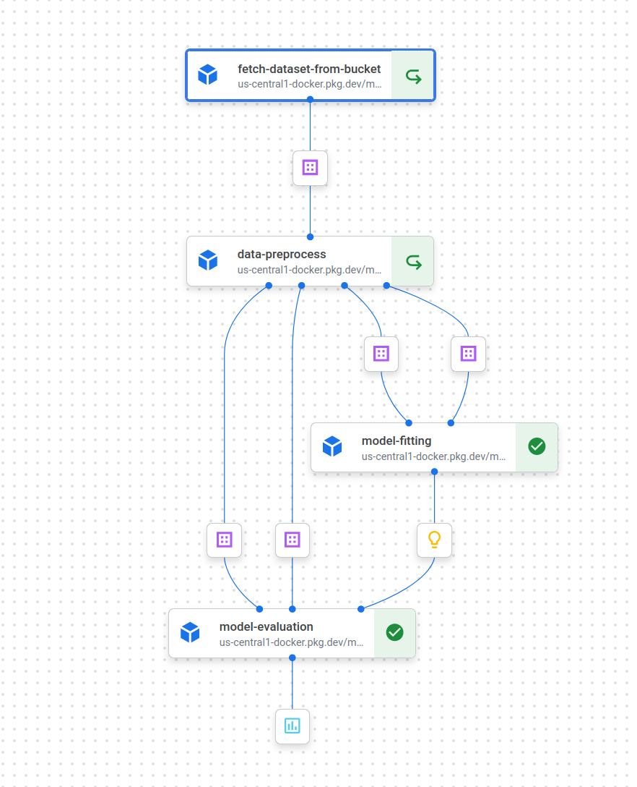

# House Price Prediction Pipeline on Vertex AI with Kubeflow

This repository contains a Kubeflow pipeline component 
and pipeline for house price prediction using Vertex AI
on Google Cloud Platform.


## Overview

The pipeline consists of several components:

1. **Data Fetching Component**: Fetches the dataset from Google Cloud Storage (GCS) and returns it as a pandas DataFrame.
2. **Data Preprocessing Component**: Preprocesses the dataset by encoding labels, dropping unused features, and splitting the dataset into training and testing sets.
3. **Model Training Component**: Trains a machine learning model using the training data.
4. **Model Evaluation Component**: Evaluates the trained model using the testing data.

### project setup

``` bash
git clone git@github.com:Gauravkumar8898/Assignment-11.git 
```
Install dependencies.
``` bash
pip install -r requirements.txt
```

Configure GCP credentials:
``` bash
gcloud auth application-default login
```

for docker image build and push run this script.

``` cmd
thecodebuzz@DESKTOP:~$ source env.sh
```
#### Running the pipeline

``` bash
python main.py
```

## Screenshot


